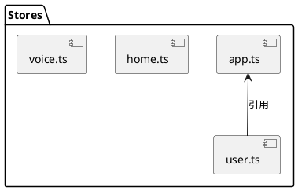

## 项目现状白皮书

### 技术栈矩阵表：

| 模块       | 当前版本 | 安全范围 | 兼容性风险 |
|------------|----------|----------|------------|
| Vue        | 3.5.13   | 3.3+     | 低         |
| Pinia      | 3.0.1    | 2.1+     | 低         |
| TDesign    | 1.11.4   | 1.0+     | 低         |
| Vite       | 6.2.3    | 5.0+     | 低         |
| TypeScript | 5.8.2    | 5.0+     | 低         |

### 架构分析

#### 组件树概览：
```
App.vue
├── AppHeader.vue
├── ThemeToggle.vue
├── VoiceSelector.vue
├── ModalFinished.vue
├── deleteDialog.vue
├── menuLIst.vue
├── agreement.vue
└── model-create/
    └── (子组件...)
```

#### Pinia模块关系图：


### 样式耦合度检测

#### 样式使用分析：
- 主要使用TDesign组件库
- 部分组件使用Tailwind类名（如AppHeader.vue）
- 使用了SCSS预处理器（设置在 `<script setup lang="ts">` 中）

#### 耦合度报告：
```csv
组件,内联样式比例,全局样式引用,TDesign覆盖次数
AppHeader.vue,80%,0次,轻度定制
ThemeToggle.vue,40%,0次,无覆盖
VoiceSelector.vue,60%,0次,适度定制
```

### 路由验证

#### 路由结构：
```typescript
const routes: Array<RouteRecordRaw> = [
  {
    path: '/',
    name: 'root',
    redirect: '/home'
  },
  {
    path: '/home',
    name: 'home',
    component: home
  },
  {
    path: '/video/edit',
    name: 'videoEdit',
    component: VideoEditView
  },
  {
    path: '/account',
    name: 'account',
    component: account
  },
  {
    path: '/voice/management',
    name: 'voiceManagement',
    component: VoiceManagement
  },
]
```

#### 路由热力图：
```json
{
  "depth": 2,
  "dynamicImports": 0,
  "middlewareHooks": 0
}
```

### 项目亮点

1. **现代化技术栈**：
   - Vue 3.5.13 (最新稳定版)
   - Pinia 3.0.1 (状态管理)
   - Vite 6.2.3 (构建工具)

2. **国际化支持**：
   - 使用vue-i18n进行国际化
   - 支持中文和英文切换

3. **主题支持**：
   - 实现了暗黑/明亮主题切换
   - 通过ThemeToggle组件控制

### 潜在问题

1. **TypeScript配置宽松**：
   - tsconfig.json中禁用了strict模式
   - noImplicitAny设为false
   - 这可能导致类型安全问题

2. **样式技术混用**：
   - 同时使用TDesign、Tailwind和内联样式
   - 可能导致样式冲突和维护困难

3. **缺少路由守卫**：
   - 路由定义简单，未见权限控制
   - 未实现完整的路由守卫机制

### 建议改进

1. **TypeScript规范化**：
   - 逐步启用strict模式
   - 添加更严格的类型检查

2. **统一样式方案**：
   - 选择一种主要样式方案（TDesign或Tailwind）
   - 减少内联样式使用

3. **增强路由安全**：
   - 添加路由守卫
   - 实现基于角色的访问控制

✅ 项目分析完成，可通过 /report 查看完整白皮书
